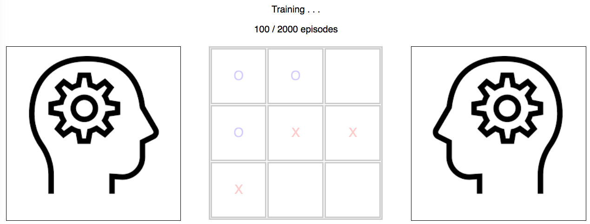

### What's this ?
This is my first "Hello World" in Reinforcement Learning.

It's a small App using React to play Tic-Tac-Toe.

To Train the Bot select first the Bot vs Bot Mode and choose how many training episodes you want the bots to play.

Then Play with the Bot in the Human vs Bot section.

Training is done as follows:
- First all possible board states (permutations) are generated and their initial values are assigned. ( 1 if win else 0 or 0.5 if game isn't over)
- Then at after each training episodes the values are updated using the equation : V(S) = V(S) + alpha*(V(S') - V(S))
- Algorithm used for Expoloration/Exploitation is epsilon greedy.

### Screenshots

#### Menu :

#### Training :

#### Human vs Bot :
